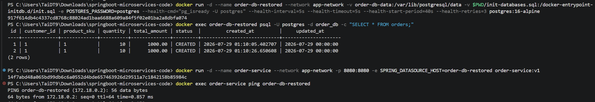

# Order Service

REST API for order management with Redis caching, built with Spring Boot 4.1.0, Java 17, and Gradle 9.5.1.

## Running Locally

### Prerequisites
- Java 17
- Gradle 9.5.1
- PostgreSQL 16
- Redis 7

### Build
```bash
gradle clean build
```

### Run

```bash
gradle bootRun
```
The service will start on port `8080`.

## Docker

### Build Image
```bash
docker build -t order-service:v1 .
```

## Docker network + Volume

### 1. Creating network..."
```bash
docker network create app-network
```
### 2. Creating volume..."
```bash
docker volume create order-db-data
```
### 3. Creating database initialization script..."
#### _sql scripts:
  [text](init-databases.sql)

### 4. Run Postgres with initialization script + app-network. Then insert data into database
```bash
docker run -d --name order-db --network app-network -v order-db-data:/var/lib/postgresql/data -v $PWD/init-databases.sql:/docker-entrypoint-initdb.d/init.sql -e POSTGRES_PASSWORD=postgres --health-cmd="pg_isready -U postgres" --health-interval=5s --health-timeout=5s --health-start-period=40s --health-retries=3 postgres:16-alpine

docker exec order-db psql -U postgres -d order_db -c "INSERT INTO orders(id, customer_id, product_sku, quantity, total_amount, updated_at) VALUES (2, '1', '1', 10, 1000, '2026-07-29')"

docker run -d --name order-service --network app-network -p 8080:8080 -e SPRING_DATASOURCE_HOST=order-db-restored order-service:v1
docker exec order-service ping order-db

```

### 5. Remove order-db container then create new with volume before
```bash
docker rm -f order-db

docker run -d --name order-db --network app-network -v order-db-data:/var/lib/postgresql/data -v $PWD/init-databases.sql:/docker-entrypoint-initdb.d/init.sql -e POSTGRES_PASSWORD=postgres --health-cmd="pg_isready -U postgres" --health-interval=5s --health-timeout=5s --health-start-period=40s --health-retries=3 postgres:16-alpine

docker exec order-db psql -U postgres -d order_db -c "SELECT * FROM orders;"
```

#### _volume affect:
  